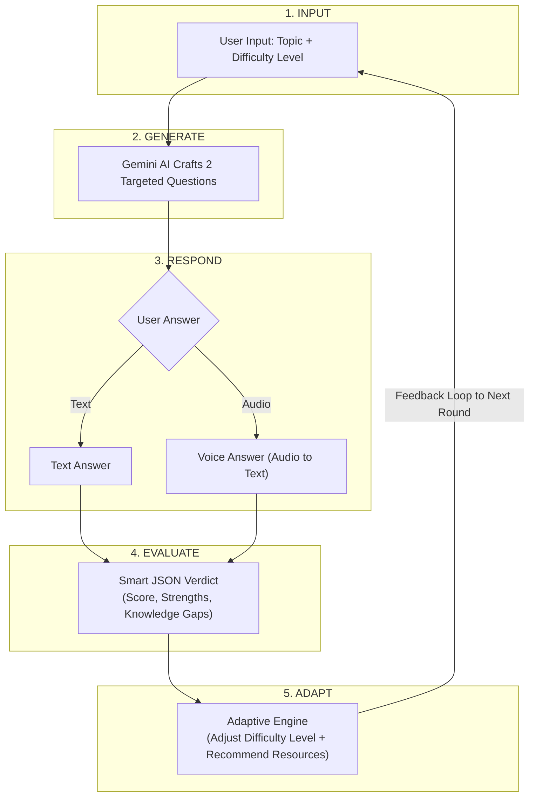

# Error418_SmartPrep_AI
SmartPrep AI is an advanced, multimodal AI interview coach powered by Google Gemini that conducts adaptive technical and behavioral mock interviews using both spoken voice audio and text, delivering granular performance analytics and curated study resources in real-time.
# 🎯 SmartPrep AI
## Personalized AI Study & Interview Coach with Smart Scoring

---

## 🎯 Problem Statement

> **Personalized AI Study / Interview Coach**
>
> Build a Gen AI-powered tool that takes a topic or job role as input, generates relevant practice questions, evaluates the user's spoken or written answers, and provides structured feedback — highlighting strengths, gaps, and suggested resources — while adapting difficulty based on performance.

---

## 🚀 What is SmartPrep AI?

**SmartPrep AI** is an intelligent, adaptive, voice-ready interview coach powered by Google Gemini.

Unlike generic mock interview tools that give vague feedback, SmartPrep AI:
- 🎙️ **Accepts voice + text answers** – Audio uploads scored just like written responses
- ⚡ **Uses smart scoring** – Clear 0–10 verdicts: Correct / Partial / Wrong / Blank
- 🎯 **Auto-adapts difficulty** – Level shifts Easy → Medium → Hard based on real performance
- 📚 **Generates personalized resources** – YouTube, docs & practice links per question
- 📊 **Tracks progress visually** – Topic-wise bar charts flag weak areas
- 📄 **Exports PDF report cards** – Shareable with mentors & recruiters

---

## ✨ Key Features

| Feature | Description |
|---------|-------------|
| 🎙️ **Voice + Text Answers** | Speak or type — audio uploads (WAV/MP3/M4A/OGG) scored just like written responses |
| ⚡ **Smart Scoring** | Clear 0–10 verdicts: 🟢 Correct / 🟡 Partial / 🔴 Wrong / ⚪ Blank |
| 🎯 **Adaptive Difficulty** | Auto-shifts Easy → Medium → Hard based on real performance |
| 📚 **Curated Resources** | Per-question YouTube, docs & practice links generated on the fly |
| 📊 **Progress Tracker** | Topic-wise bar charts flag weak areas needing urgent focus |
| 🎯 **Skill Radar** | Visual breakdown of Clarity, Technical Depth, Structure & Examples |
| 📄 **PDF Report Card** | Downloadable session report — shareable with mentors & recruiters |
| 🔄 **Session History** | Complete answer history with scores and feedback |

---

## 🏗️ Architecture
Here are two copyable versions of the **SmartPrep AI Pipeline Flowchart**:

---

)

---

